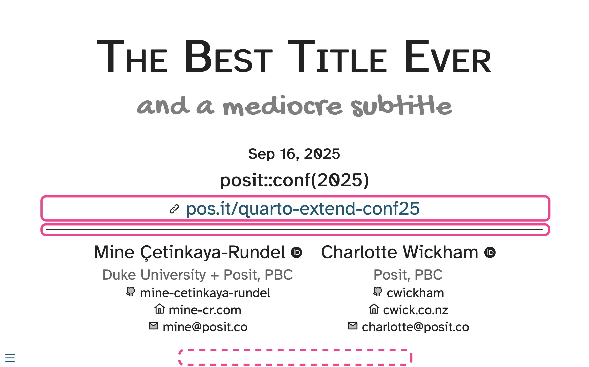

# Example 4: Move footer + add horizontal line

- Remove the link to slides from the footer (using `include-after-body`) and use that field in the partial to be displayed below the venue.

- Display content from `footer` under venue with a link icon, e.g., <https://icon-sets.iconify.design/line-md/?icon-filter=link>.

- Add a horizontal line below the slide URL.

