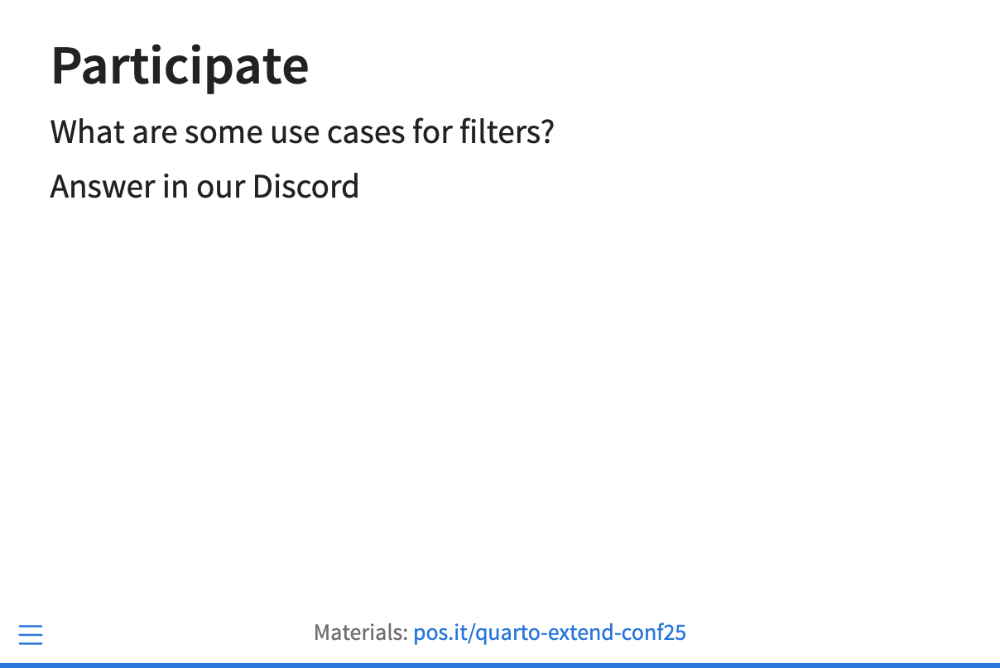

Write the `participate.lua` filter to combine the content of the question in the div with class `.participate` with boilerplate text: 

```markdown
Answer in our Discord!
```

Your slide should look like this:



Hints:

* Recall the useful pattern: create an empty `pandoc.Blocks()`, `insert` `Block`s, `extend` with `Blocks`.

* You can pass `pandoc.Str()` a string with spaces. 

